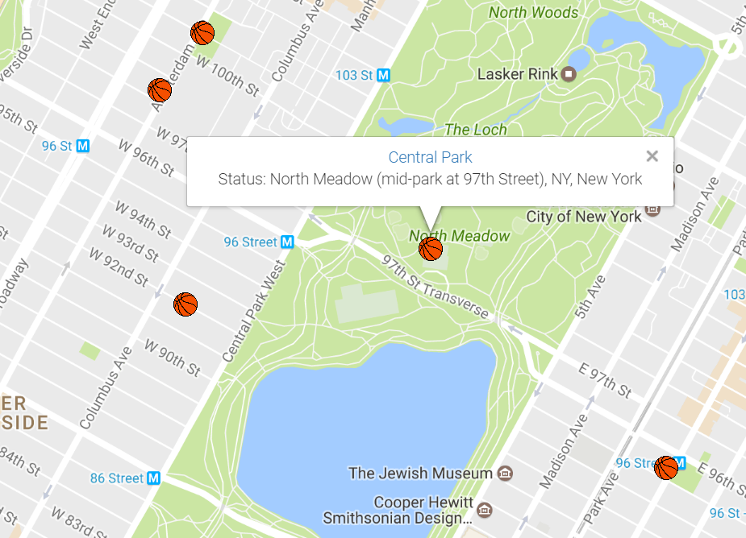

# Swish NYC Basketball Court Finder Web App

### This repository handles the client-side code for the Swish Web App

Swish is a real-time pickup basketball court web app where users can search and choose public basketball courts near them. Once a court is chosen, the user will be able to see or request a status update from other users indicating whether the court is currently too crowded, empty, perfect to get a pickup game in. Users will be able to add a court, designate favorite courts, and view detailed information about every court in NYC. 

App live at: *This app is currently under development and not yet deployed to production*

To download, git clone this repo and then run:
```
npm install
npm run start
```



Included Key Dependencies:
* react
* react-dom
* react-google-maps
* redux
* react-redux
* react-router
* react-router-redux
* redux-saga
* axios
* babel
* webpack, webpack-dev-server

Backend code is managed [here](https://github.com/srosenshein/Swish-Api)
